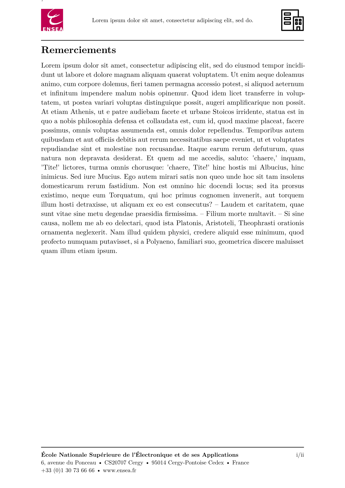

# ENSEA - Typst Internship Template (unofficial)

Unofficial Typst template for internship reports at ENSEA, a French engineering school.

## Usage

Either use this template in the Typst web app:
```typst
#import "@preview/volt-internship-ensea:0.1.0": *
```
or use the command line to initialize a new project based on this template:
```typst
typst init volt-internship-ensea
```

## Default Values

| Parameter                | Default Value | Description                            | Mandatory |
|--------------------------|----------------|----------------------------------------|-----------|
| `companyLogo`            | `none`         | Path to the company logo               | ✅         |
| `authors`                | `none`         | Name(s) of the report author(s)        | ✅         |
| `studentInfo`            | `none`         | Information about the student(s)       | ✅         |
| `title`                  | `none`         | Title of the internship report         | ✅         |
| `internshipDetails`      | `none`         | Company name, location, duration, etc. | ✅         |
| `enableListOfFigures`    | `true`         | Enable the list of figures             | ❌         |
| `enableListOfTables`     | `false`        | Enable the list of tables              | ❌         |
| `enableListOfAppendices` | `false`        | Enable the list of appendices          | ❌         |
| `enableBibliography`     | `true`         | Enable the bibliography                | ❌         |
| `enableAppendices`       | `true`         | Enable the appendix section            | ❌         |


## Example

```typst
#import "@preview/volt-internship-ensea:0.1.0": *

#show: lab-internship.with(
companyLogo: "template/media/logo.png",
authors: (
"Jean DUPONT",
),
studentInfo: [*Élève ingénieur en X#super[ème] année* #linebreak()
Promotion 20XX #linebreak()
Année 20XX/20XX],
title: [#lorem(10)],
internshipDetails: [Stage effectué du *1er mars au 30 août 2025*, au sein de la société *TechSolutions*, située à Paris.

Sous la responsabilité de : #linebreak()
- M. *Pierre LEFEVRE*, Directeur de la Stratégie #linebreak()
- Mme *Marie DUBOIS*, Responsable des Opérations #linebreak()
],
enableListOfFigures: false,
enableBibliography: false,
enableAppendices: false,
)

= Introduction
#lorem(120)
```

<p align="center">

</p>

<p align="center">

</p>

<p align="center">

</p>

<p align="center">

</p>

## License

The Typst template is licensed under the [MIT license](https://github.com/Dawod-G/ENSEA_Typst-Template/blob/master/LICENSE.md). This license does not apply to the ENSEA logo or associated image files, which remain the property of ENSEA.