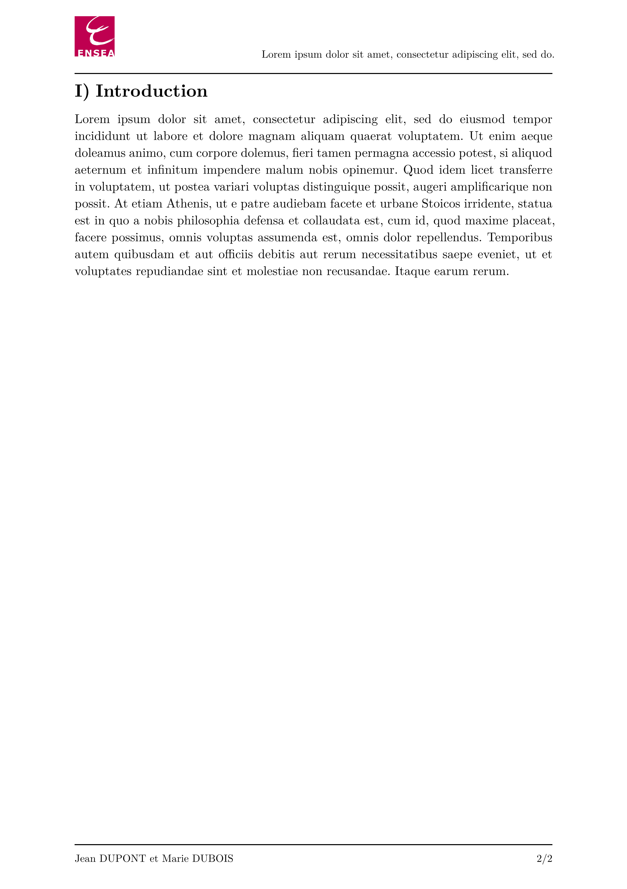

# ENSEA - Typst Lab Template (unofficial)

Unofficial Typst template for lab reports at ENSEA, a French engineering school.

## Usage

Either use this template in the Typst web app:
```typst
#import "@preview/volt-lab-ensea:0.1.0": *
```
or use the command line to initialize a new project based on this template:
```typst
typst init volt-lab-ensea
```

## Default Values

| Parameter       | Default Value | Description                                          |
|-----------------|---------------|------------------------------------------------------|
| `title`         | `none`        | Title of the lab report                              |
| `authors`       | `none`        | Name(s) of the student(s) contributing to the report |
| `studentInfo`   | `none`        | Information about the student(s)                     |
| `labDescription`| `none`        | Description of the lab objectives                    |

All fields listed above are **mandatory**.


## Example

```typst
#import "@preview/volt-lab-ensea:0.1.0": *

#show: lab-report.with(
  title: [#lorem(10)],
  authors: (
    "Jean DUPONT",
    "Marie DUBOIS",
  ),
  studentInfo: [*Élève ingénieur en X#super[ème] année* #linebreak()
    Promotion 20XX #linebreak()
    Année 20XX/20XX],
  labDescription: [
    - #lorem(15) #linebreak()
    - #lorem(15) #linebreak()
    - #lorem(15)
  ],
)

= Introduction
#lorem(120)
```

<p align="center">
    
</p>

<p align="center">
    
</p>

## License

The Typst template is licensed under the [MIT license](https://github.com/Dawod-G/ENSEA_Typst-Template/blob/master/LICENSE.md). This license does not apply to the ENSEA logo or associated image files, which remain the property of ENSEA.