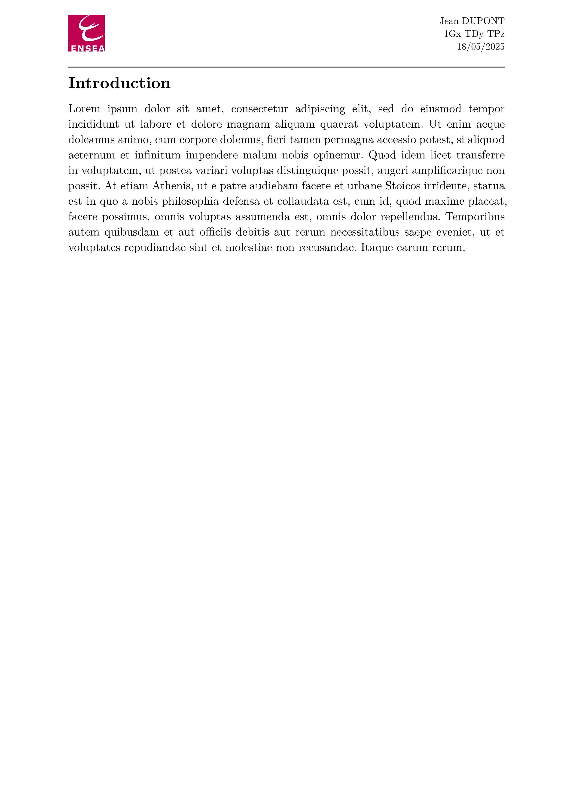

# ENSEA - Typst Letter Template (unofficial)

Unofficial Typst template for short documents at ENSEA, a French engineering school.

## Usage

Either use this template in the Typst web app:
```typst
#import "@preview/volt-letter-ensea:0.1.0": *
```
or use the command line to initialize a new project based on this template:
```typst
typst init volt-letter-ensea
```

## Default Values

| Parameter | Default Value         | Description                       |
|-----------|------------------------|-----------------------------------|
| `authors` | `none`                 | Name(s) of the document author(s) |
| `position`| `none`                 | Position or role of the author(s) |
| `date`    | `datetime.today()`     | Date of the document              |

All fields listed above are **optional**.

## Example

```typst
#import "@preview/volt-letter-ensea:0.1.0": *

#show: letter.with(
  authors: (
    "Jean DUPONT",
  ),
  position: [1Gx TDy TPz],
  date: datetime.today(),
)

= Introduction
#lorem(120)
```

<p align="center">
    
</p>

## License

The Typst template is licensed under the [MIT license](https://github.com/Dawod-G/ENSEA_Typst-Template/blob/master/LICENSE.md). This license does not apply to the ENSEA logo or associated image files, which remain the property of ENSEA.